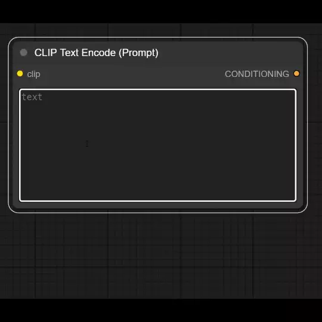
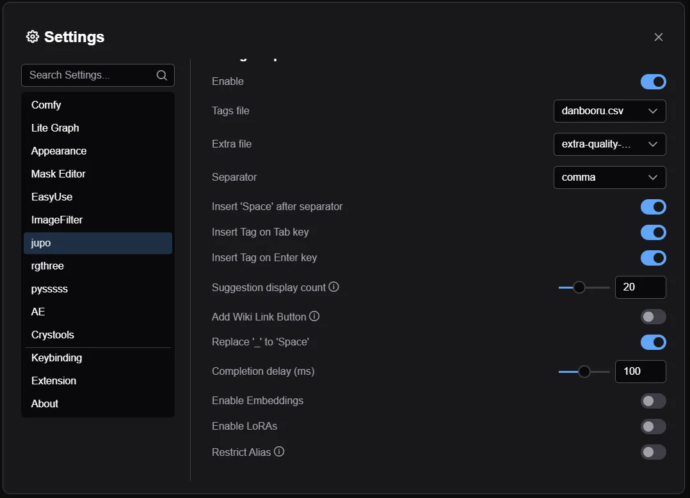

# ComfyUI-Ex-TagComplete



この拡張機能は[ComfyUI-Custom-Scripts](https://github.com/pythongosssss/ComfyUI-Custom-Scripts)を参考にしています。

また、tagsフォルダ内の

- danbooru.csv
- danbooru_e621_merged.csv
- extra-quality-tags.csv

は[a1111-sd-webui-tagcomplete](https://github.com/DominikDoom/a1111-sd-webui-tagcomplete)よりお借りしました。


## Install
```
cd ComfyUI\custom_nodes
git clone https://github.com/jupo-ai/comfy-ex-tagcomplete.git
```

## Settings

- **Enable**
  - 機能の有効化
- **Tags file**
  - メインタグのcsvファイル
  - tagsフォルダ内の **extraで始まるcsv以外** が対象
- **Extra file**
  - 追加タグのcsvファイル
  - tagsフォルダ内の **extraで始まるcsvのみ** が対象
- **Separator**
  - タグ挿入したときに後ろにつけるやつ
  - カンマ(,) ピリオド(.) none(なし) から選択
- **Insert 'Space' after separator**
  - セパレータの後に空白も挿入するか
- **Insert Tag on Tab key**
  - Tab キーで挿入するか
- **Insert Tag on Enter key**
  - Enter キーで挿入するか
- **Suggestion display count**
  - タグ候補の表示数
  - 0で全て表示するが重くなる
- **Add Wiki Link Button**
  - タグ候補左にwiki (danbooru / e621) へのリンクボタンを追加する
- **Replace '_' to 'Space'**
  - タグの _ を空白に置き換える
- **Completion delay(ms)**
  - 入力してからタグ候補を表示するまでの時間
  - 早すぎるとタイピングに検索が追いつかなくて、正しく表示されない
- **Enable Embeddings**
  - Embeddingファイルも候補に含める
- **Enable LoRAs**
  - LoRAファイルも候補に含める
- **Restrict Alias**
  - ONにすると、Alias(1girls => 1girlなど)が完全一致の場合のみ表示される
  - 例えば、1girlsまで入力しないと「1girls => 1girl」のAliasは表示されない

## ToDo
- ~~embeddings~~: done
- ~~loras~~: done
- 
